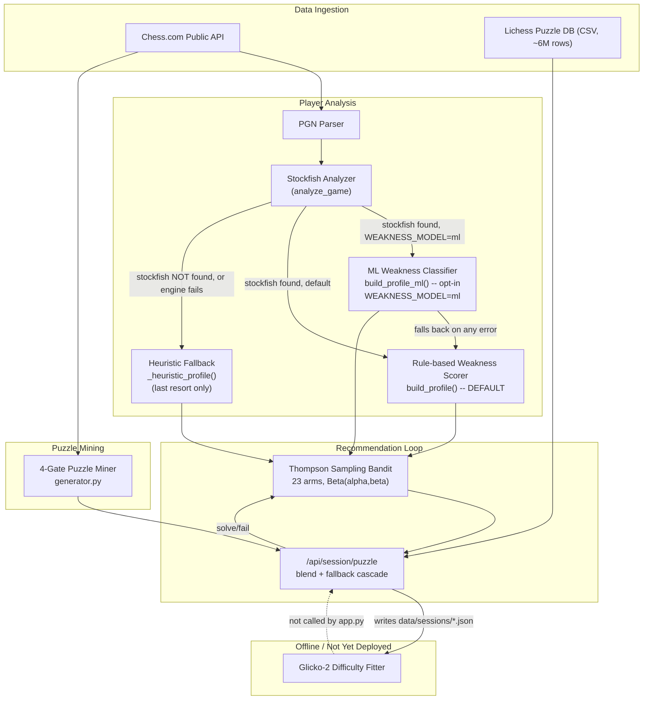
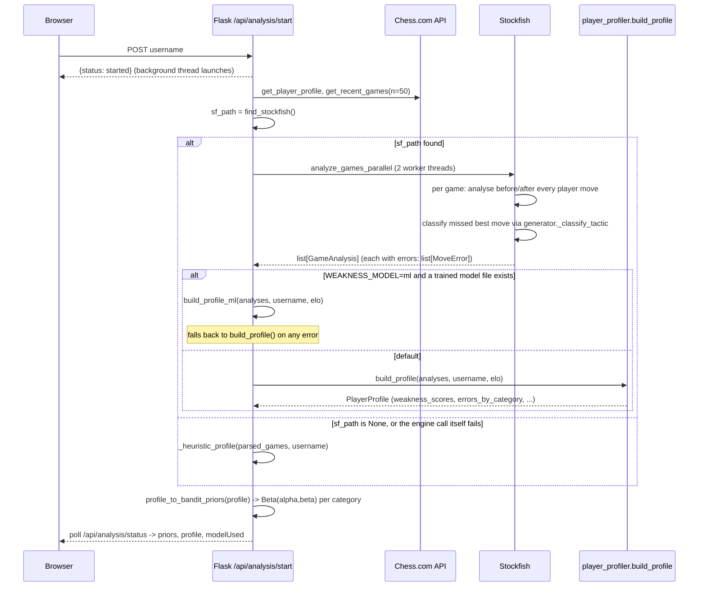
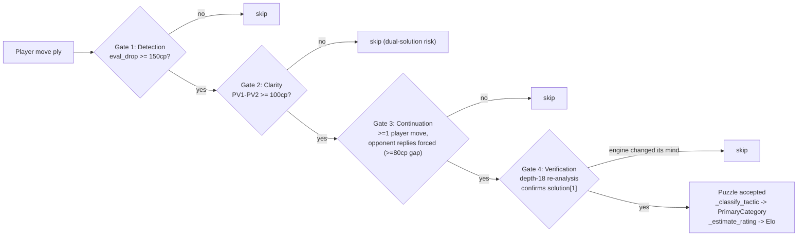
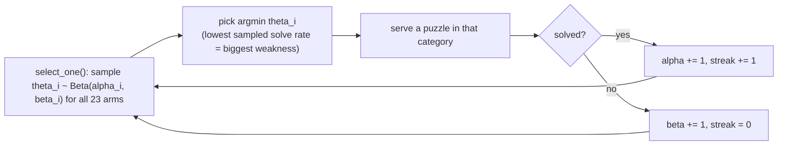
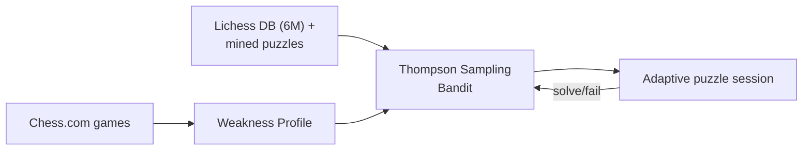
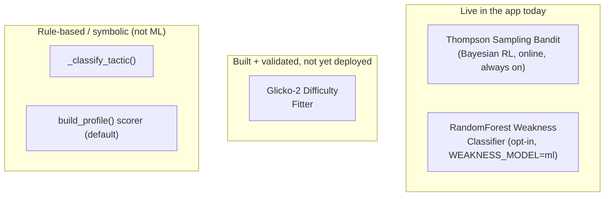

# Adaptive Chess Puzzle Advisor — System Documentation

MSc AI & Data Science Dissertation — City College, University of York
**Aleksandar Radevski** | July–October 2026

*This document is a from-the-source-code technical reference, regenerated in full after the improvement-plan work (test suite, Glicko-2 difficulty fitting, trained weakness classifier, and a `MoveError` category-classification fix), and subsequently updated after fixing the `analysis_start()` Stockfish-detection bug and wiring `build_profile_ml()` into the live app as an opt-in path (§6.1, §6.3). Every diagram, table, and constant below was read directly out of the current codebase — nothing here is aspirational. Where the code contradicts the README or itself, that is called out explicitly rather than smoothed over, per your own instruction the first time this document was written.*

---

## 1. Abstract

The Adaptive Chess Puzzle Advisor analyses a player's Chess.com game history, estimates which tactical categories they are weak in, and then runs an adaptive puzzle-recommendation session that concentrates practice on those weaknesses using a Thompson Sampling multi-armed bandit. Puzzles come from two sources: a 6-million-row Lichess puzzle database (filtered and re-categorised), and puzzles mined directly from the player's own games via a four-gate Stockfish verification pipeline. Two further components exist as **validated research artefacts, gated on real-player data volume rather than the app's default**: a Glicko-2 difficulty-rating fitter for puzzles and players (still fully offline), and a RandomForest classifier trained to predict a player's per-category weakness profile as an alternative to the hand-tuned rule engine (now reachable in the live app as an opt-in flag, see §6.3).

---

## 2. System Overview



Solid arrows are live, wired-up data flow. The dashed arrow is built, tested, and validated, but not currently invoked by `web/backend/app.py` — see §6 for exactly what that means and why. As of this pass, both `build_profile()` (default) and `build_profile_ml()` (opt-in via the `WEAKNESS_MODEL=ml` environment variable) are genuinely reachable — see §6.1 and §6.3, which previously documented these as bugs and now record the fix.

---

## 3. Pipeline 1 — Player Analysis (Weakness Profiling)



`find_stockfish()` (fixed this pass, §6.1) checks the project's bundled binary path as well as `PATH`, so `sf_path` now resolves correctly out of the box. `modelUsed` is a new field in the status response (`"rule-based (Stockfish-verified)"`, `"ml (RandomForest, trained on simulated players)"`, or `"heuristic (no Stockfish found, or analysis failed)"`) so it's always possible to see, per analysis run, exactly which of the three scoring paths actually produced the profile.

### 3.1 Chess.com ingestion (`src/api/chess_com_fetcher.py`)

Chess.com's Published Data API is fully public (no OAuth/API key). `get_player_profile()` and `get_recent_games()` fetch and disk-cache every response under `data/cache/chess_com/` so repeated runs never re-hit the network. `get_recent_games()` walks monthly archives newest-first, respecting a 0.5s delay between calls per Chess.com's rate-limit guidance, and stops once `n` games are collected (default 50 for analysis, 60 for puzzle mining, 30 for style).

### 3.2 PGN parsing (`src/data/pgn_parser.py`)

`parse_game()` extracts player colour, result, ratings, and opening (ECO code + a family name parsed from Chess.com's `ECOUrl`, e.g. `Italian-Game-Classical-Variation` → family `"Italian Game"` via a 30-entry lookup table `_TWO_WORD_FAMILIES`, falling back to the first two words). `get_game_phase(board)` classifies any position as opening/middlegame/endgame purely from piece count (≥28 pieces = opening, 14–27 = middlegame, <14 = endgame) — this function is shared by both the analyzer and the puzzle generator, so "phase" always means the same thing everywhere in the codebase.

### 3.3 Stockfish game analysis (`src/classifier/stockfish_analyzer.py`)

`analyze_game()` walks every move the *player* made (skipping the first 8 half-moves as opening theory) and, for each one:

1. Evaluates the position **before** the move at `ANALYSIS_TIME=0.05s` (depth ≈10–12).
2. Snapshots that pre-move FEN and the engine's principal-variation best move.
3. Pushes the player's actual move, evaluates again, and computes `cp_loss = score_before − score_after`.
4. If `cp_loss ≥ INACCURACY_CP (50)`, records a `MoveError`.

```python
INACCURACY_CP = 50
MISTAKE_CP    = 100
BLUNDER_CP    = 200
```

**`MoveError` now carries a `category` field** (added this iteration): the engine's missed best move is classified via `generator._classify_tactic()` — the exact same function the puzzle miner uses — so "what tactic did I miss" is answered identically whether the position came from a mined puzzle or a raw game-analysis error. Before this iteration, `MoveError` only had `phase`/`severity`; category-level weakness signal did not exist anywhere in game analysis.

**Bug fixed this iteration:** `fen_before` used to be read via `board.fen()` *after* `board.push(move)` had already mutated the board in place — every stored "before" FEN was silently the post-move position. Fixed by snapshotting the FEN before the push.

Parallelism: `analyze_games_parallel()` runs one Stockfish subprocess per thread (default 2 workers in the live app, configurable) — no shared engine state, no locking needed.

### 3.4 The rule-based weakness scorer (`src/classifier/player_profiler.py`)

`build_profile()` aggregates a list of `GameAnalysis` into a `PlayerProfile`: game record (won/lost/drawn), error counts by severity, `errors_by_phase`, `errors_by_category` (new), opening repertoire (top 10 per colour, by games played), and `weakness_scores` — a `{category: float}` map in **[0, 1]**, 0 = strong, 1 = weak.

`_compute_weakness_scores()` is **hand-tuned rules**, not a trained model:

| Signal | Rule | Effect |
|---|---|---|
| middlegame error rate > 0.5 | `boost = min(0.25, rate * 0.3)` | Fork/Pin/Skewer/Discovered Attack/Sacrifice/Deflection/Hanging Piece/King Safety each `+= boost` |
| endgame error rate > 0.25 | `boost = min(0.30, rate * 0.4)` | Endgame/Rook/Queen/Pawn/Knight/Bishop Endgame each `+= boost` |
| blunders/game ≥ 2 | fixed `+0.25` | Hanging Piece, Fork, Pin |
| blunders/game ≥ 1 | fixed `+0.15` | Hanging Piece, Fork |
| accuracy estimate < 70 | fixed `+0.10` | Fork, Pin, Skewer, Discovered Attack |

All 23 categories start at 0.5 and are clamped to ≤0.9–0.92 depending on the rule. This is deliberately conservative and coarse — see §7 for why a trained classifier was built to eventually replace it, and why it hasn't been swapped in yet.

`profile_to_bandit_priors()` converts `weakness_scores` into `Beta(alpha, beta)` pairs with `alpha + beta = 10` (a modest prior — real puzzle-session evidence overrides it quickly): `alpha = round((1 - weakness) * 10)`, `beta = 10 - alpha`.

### 3.5 The heuristic fallback (`web/backend/app.py::_heuristic_profile`)

A much cruder, engine-free profiler that only looks at **win/loss/game-length patterns** from parsed PGN headers — no board analysis at all. It buckets every category into just two groups (`TACTICAL` / `ENDGAME`) and sets both to a single shared score derived from win rate and short-loss / long-loss ratios:

```python
tactical_w = clamp(0.75 - win_rate*0.50 + short_loss_rate*0.20, 0.30, 0.85)
endgame_w  = clamp(0.60 - win_rate*0.30 + long_loss_rate*0.30,  0.25, 0.80)
```

Every tactical category gets the *same* `tactical_w`, every endgame category the *same* `endgame_w` — there is no per-category differentiation at all in this path. Until this pass this was, in practice, the path that ran almost all the time, because of the Stockfish-detection bug described (and now fixed) in §6.1; it now serves its originally-intended role as a genuine last resort, used only when Stockfish truly can't be found or the engine call itself errors out.

---

## 4. Pipeline 2 — Puzzle Mining from Real Games (`src/puzzles/generator.py`)

The module docstring is explicit that an earlier heuristic-only mode (no engine, pure python-chess pattern matching) was **removed** after producing roughly 40% false positives — puzzles whose "solution" wasn't actually best. The only mode now is a four-gate Stockfish pipeline:



Current tuning constants (read directly from `generator.py` — **the README and `eval/run_evaluation.py`'s docstring both quote older values**, see §6.2):

| Constant | Current value | Meaning |
|---|---|---|
| `PUZZLE_THRESHOLD` | 150 cp | Minimum eval-drop to count as a blunder worth a puzzle |
| `MIN_CLARITY_CP` | 100 cp | PV1 must beat PV2 by at least this (rejects dual solutions) |
| `FORCED_OPP_MARGIN` | 80 cp | Opponent's reply must be this much better than its alternative to count as "forced" |
| `DETECT_TIME` | 0.10 s | Stockfish time per position during detection |
| `VERIFY_DEPTH` | 18 ply | Depth for the final re-verification pass |
| `SOLUTION_DEPTH` | 16 ply | Depth used while building the continuation |
| `CONTINUATION_MOVES` | 6 | Max extra half-moves appended after the player's first move |
| `MAX_PER_GAME` | 5 | Hard cap on puzzles extracted per game |
| `SKIP_PLIES` | 8 | Ignore the opening (theory gaps, not tactics) |

`_classify_tactic(board, move)` is a **hand-written, symbolic** classifier (not learned) that inspects the resulting position with python-chess and returns one of: `Mating Pattern`, `Promotion`, `Fork` (≥2 opponent pieces attacked, at least one heavy/loose), `Hanging Piece` (undefended capture), `Deflection` (capturing a defender of something else), `Pin`/`Skewer` (a sliding piece attacks through an opponent piece to the king), `Discovered Attack`/`King Safety` (delivers check), `Sacrifice` (captures with a piece worth ≥100cp more than the target), `X-Ray Attack`, `{Pawn,Rook}/Endgame` (≤12 pieces left), `Quiet Move` (no capture, no check — added this codebase's history specifically because a third of generated puzzles were falling into an unlabelled "General" bucket), or `General` as the final fallback.

`_estimate_rating(eval_drop, solution_len)`: `base = 800 + min(eval_drop − 150, 700) * 0.6 + (solution_len − 2) * 150`, clamped to `[700, 2400]`. `_difficulty_tier()` then buckets that rating into Beginner/Intermediate/Advanced/Hard/Expert (a *different*, simpler 5-tier scheme than the Lichess-pool's 7-tier `DIFFICULTY_TIERS` in `puzzle_loader.py` — see §6.4).

Puzzles are saved to `data/user_puzzles/<username>.json`, deduplicated by `PuzzleId`, and merged with any existing file — mining is additive across sessions, never destructive.

---

## 5. Pipeline 3 — The Puzzle Pool & Recommendation Loop

### 5.1 Building the served pool (`src/data/puzzle_loader.py`, `scripts/build_puzzle_dataset.py`)

`scripts/build_puzzle_dataset.py` streams the raw ~6M-row Lichess CSV in 1M-row chunks (to bound memory), enriches and cleans each chunk, and writes:

- `data/processed/puzzles_full.parquet` — the whole cleaned+enriched set
- `data/processed/puzzles_by_category/*.parquet` — one file per `WEAKNESS_CATEGORY`
- `data/processed/puzzles_by_tier/*.parquet` — one file per difficulty tier
- `data/processed/category_summary.csv` — counts per category

Real counts from the current dataset:

| Category | Puzzle count | Category | Puzzle count |
|---|---:|---|---:|
| Endgame | 2,942,587 | Attraction | 216,012 |
| Mating Pattern | 1,849,329 | Promotion | 142,800 |
| King Safety | 766,027 | Skewer | 130,482 |
| Fork | 758,947 | Queen Endgame | 113,304 |
| Sacrifice | 447,248 | Interference | 91,293 |
| Rook Endgame | 362,109 | Bishop Endgame | 81,399 |
| Pin | 355,611 | Clearance | 78,289 |
| Discovered Attack | 330,422 | Zugzwang | 62,068 |
| Deflection | 293,854 | Knight Endgame | 49,229 |
| Hanging Piece | 278,677 | X-Ray Attack | 21,100 |
| Quiet Move | 247,767 | En Passant | 8,375 |
| Pawn Endgame | 219,843 | | |

`clean()` (`src/data/data_cleaner.py`) then drops rows with missing FEN/Moves/Rating, de-duplicates by `PuzzleId`, drops rating-deviation > 150 (poor calibration), drops never-played puzzles, and requires a non-empty solution.

**A real, documented bug fix lives in the enrichment logic**: Lichess emits theme tags alphabetically, so a naive "first tag wins" rule let the *phase* tag `endgame` outrank real motifs — `crushing endgame fork short` was filed under "Endgame" instead of "Fork", mislabelling ~198k of 305k "Endgame"-tagged puzzles (~45% of that category) and corrupting the bandit's weakness model for anyone who solved them. `MOTIF_PRIORITY` fixes this with an explicit specificity ranking (forced mate > concrete tactical motif > generic attack > endgame type > bare endgame > General), and `_apply_quality_gate()` in `app.py` re-runs this resolver over the live pool at load time so even a parquet file built before the fix is corrected in memory.

At server start, `_load_puzzles()` reads the parquet **one row-group at a time** (never materialising the full 6M rows), applies a quality gate (`Rating` in range, `Popularity ≥ MIN_POPULARITY`, `NbPlays ≥ MIN_NB_PLAYS`, `RatingDeviation ≤ MAX_RATING_DEV`, solution length ≥ `MIN_HALF_MOVES`, no `LOW_QUALITY_THEMES` like `equality`/`defensiveMove`, and `PrimaryCategory != "General"`), proportionally samples each row-group down to a pool cap, and builds a `PUZZLE_BY_CAT` index for O(1) category lookups.

### 5.2 Thompson Sampling bandit (`src/recommender/bandit.py`)

The actual adaptive-learning core of the system. One arm per `WEAKNESS_CATEGORY` (23 arms), each a `Beta(alpha, beta)` posterior over "probability the player solves a puzzle in this category":



This is genuine Bayesian sequential decision-making: each arm's belief is a full posterior distribution (not a point estimate), and sampling from it naturally balances **exploration** (arms with high uncertainty / wide posteriors occasionally get picked even if their mean looks fine) against **exploitation** (arms with a confidently low mean get picked most often) — no separate epsilon-greedy or UCB bolt-on is needed, which is the classical argument for Thompson Sampling over simpler bandit strategies.

State is fully serialisable (`to_dict()`/`from_dict()`) and persisted per-user in `data/sessions/<username>.json` after every puzzle attempt, so a session picks up exactly where it left off across visits, including `history` (used later by the Glicko-2 fitter), `streak`, and `best_streak`.

#### 5.2.1 The mathematics, in full

The bandit models each of the 23 categories as an independent **Bernoulli process**: every time the player attempts a puzzle in category *i*, the outcome is either a solve (1) or a fail (0), governed by some unknown true probability `p_i = P(solve | category i)`. The goal is to estimate every `p_i` online and use those estimates to decide what to serve next, without ever pausing to "train" on a batch.

**Why Beta?** The Beta distribution is the *conjugate prior* for a Bernoulli/Binomial likelihood: if the prior belief about `p_i` is `Beta(α, β)`, and `s` new successes and `f` new failures are then observed, the posterior belief is **exactly** `Beta(α+s, β+f)` — no numerical integration, no approximation, just two additions. That closed-form update is literally what `ThompsonBandit.update()` does:

```python
if solved: arm.alpha += 1
else:      arm.beta  += 1
```

**What α and β mean, concretely:**

| Quantity | Meaning |
|---|---|
| `α − 1` | effective number of "successes" the system has seen for this arm (real solves + whatever the prior contributed) |
| `β − 1` | effective number of "failures" seen |
| `α + β` | total effective evidence — bigger ⇒ narrower, more confident posterior |
| `Beta(1, 1)` (the default `ArmState()`) | the uniform distribution on [0, 1] — "before any evidence, every solve rate from 0% to 100% is equally plausible" |

Two numbers you can read directly off any `Beta(α, β)`:

| Quantity | Formula | Meaning |
|---|---|---|
| Mean | `α / (α + β)` | best point estimate of the true solve rate |
| Variance | `αβ / [(α+β)² (α+β+1)]` | how uncertain that estimate still is — shrinks as `α+β` grows |

**Selection rule, and why it explores automatically.** `select_one()` does *not* just pick the category with the lowest **mean** — that would be pure exploitation, and would never revisit a category that happened to get a couple of early unlucky fails. Instead it draws one random sample `θ_i ~ Beta(α_i, β_i)` *per arm* and picks the arm with the lowest **sampled** value. An arm the player has barely touched (say `α=1, β=1`, mean 0.5, but huge variance) can still be sampled at, say, `θ=0.15` purely by chance — giving it a real shot at being picked even though its mean looks "average," precisely because the system doesn't yet know that mean is trustworthy. As real attempts accumulate, `α+β` grows, the posterior narrows, and the sampled `θ` converges tightly around the true mean — exploration fades naturally into exploitation without any separate schedule or tunable epsilon. This is the textbook argument for Thompson Sampling (Thompson, 1933; modern regret-bound treatment in Russo et al., 2018) over epsilon-greedy or UCB-style bandits.

**Why "lowest" θ, not "highest."** Standard bandit literature maximises reward — pick the arm with the highest sampled value. This system deliberately inverts that: `θ` is being used as an estimate of *proficiency* (`P(solve)`), and the pedagogical objective is to spend practice time on the player's **weakest** category, so `select_one()` returns `min(samples, key=samples.get)`. Getting this backwards (picking the argmax) would silently turn the app into a system that serves *more* puzzles in categories the player is already good at — worth stating explicitly if asked "why min and not max," because it is the one place this bandit deliberately departs from the textbook formulation.

**Worked numeric example.** Suppose the player has attempted "Fork" 8 times and solved 3, starting from the default `Beta(1,1)` prior: `α = 1+3 = 4`, `β = 1+5 = 6`, mean `= 4/10 = 0.4`. In any given selection round, `arm.sample()` might return `0.28` (below the mean — makes Fork look even weaker, likely to be picked) or `0.55` (above the mean — Fork looks fine this round, probably loses out to a genuinely weaker arm). Both are legitimate draws from `Beta(4,6)`; the randomness is not noise to be eliminated — it is the mechanism that keeps every arm honestly in contention in proportion to how much is still unknown about it.

**How the priors get seeded.** `profile_to_bandit_priors()` converts a `weakness_scores` map (0=strong, 1=weak) into `Beta(α, β)` pairs with a fixed budget of `α + β = 10` "pseudo-observations": `α = round((1 − weakness) × 10)`, `β = 10 − α`. A weakness score of 0.8 becomes `Beta(2, 8)` — the system starts already believing this category is weak, but with only the confidence of 10 pretend attempts, so 5–6 real solves/fails can already outweigh it. This is deliberate: the priors should give the bandit a sensible starting point without letting a possibly-wrong upstream profiler (see §6.1's heuristic-fallback issue) dominate real evidence for long.

### 5.3 Serving a puzzle (`/api/session/puzzle`)

Not a naive "grab any puzzle in the bandit's chosen category" — a fallback cascade that prefers, in order:

1. **User-mined puzzles** (`data/user_puzzles/<user>.json`) in the bandit's target category, in range, unseen.
2. *(40% of the time, if no in-category mined puzzle exists)* any unseen mined puzzle in range, re-labelling the session target to whatever category it actually is.
3. Lichess pool, target category, requested rating window.
4. Lichess pool, target category, rating window widened by ±200.
5. Lichess pool, *any* category, requested rating window (target re-labelled).
6. Lichess pool, any category, full rating range.
7. If truly nothing unseen remains: allow a repeat, but flag `poolExhausted: true` in the response rather than silently repeating.

Rating window narrows to the player's known Elo ±300 when available. `/api/session/result` updates the bandit, appends a `{ts, puzzleId, category, rating, solved}` history entry (unless the attempt was a skip), and persists — this history file is exactly what `difficulty_fitter.load_solve_events()` reads (§7.1).

### 5.4 Puzzle quality evaluation (`eval/puzzle_evaluator.py`, `eval/run_evaluation.py`)

A separate, composite 5-dimension quality score (used to validate the *generator*, not to serve puzzles):

| Dimension | Weight | Criterion |
|---|---:|---|
| `engine_agrees` | 0.30 | Stockfish (depth 18) confirms the intended move is still best |
| `clarity_cp` | 0.25 | PV1−PV2 gap: full credit ≥150cp, partial ≥80cp, none below |
| `solution_depth` | 0.20 | ≥3 ply total |
| `not_trivial` | 0.15 | Not an undefended free capture with no follow-up |
| `difficulty_fit` | 0.10 | \|puzzle rating − player Elo\| ≤ 300 |

`python eval/run_evaluation.py --username <user> --elo <elo>` runs this over a user's mined puzzles and prints a full report (per-metric pass rates, category breakdown, top/bottom-N puzzles, tuning recommendations), saved to `eval/reports/<user>_<timestamp>.json`. `app.py`'s `/api/generate/quality/<user>` route recomputes a lighter, engine-free version of the same weighted formula from stored puzzle metadata for the live UI dashboard.

---

## 6. Discovered Contradictions and Bugs

These were found by reading the current source directly, not carried over from the previous version of this document.

### 6.1 ✅ Fixed — the real weakness-scoring path now actually runs Stockfish

`analysis_start()` in `app.py` used to locate Stockfish with:

```python
sf_path = shutil.which("stockfish")
```

This only found a binary literally named `stockfish` (or `stockfish.exe`) somewhere on the system `PATH`. It did **not** check the project's bundled binary at `stockfish/stockfish-windows-x86-64-avx2.exe`. This was inconsistent with `generate_puzzles()` and `_eval_engine()`, both of which correctly call `stockfish_analyzer.find_stockfish()` — a function that explicitly checks that exact bundled path as a fallback. Unless `stockfish` had been separately added to PATH under that exact name, `analysis_start()`'s `sf_path` was `None` on this machine, meaning:

- `build_profile()` (the real, Stockfish-verified, per-category rule-based scorer) was **never reached** in the live app.
- Every login/registration silently fell through to `_heuristic_profile()` — the two-bucket, no-board-analysis fallback described in §3.5.

**Fix applied:** `analysis_start()` now imports and calls `find_stockfish()` from `stockfish_analyzer.py` — the same resolver already used by puzzle mining and the eval bar — instead of the bare `shutil.which` call. `build_profile()` is now the path that runs by default on every successful analysis. Puzzle *mining* and the eval bar were never affected by this bug; only the weakness-profiling analysis path was.

**A second, related bug this exposed:** fixing §6.1 meant `analyze_game()`'s real Stockfish calls ran against live games for the first time in this project's history (previously masked entirely, since this code path was unreachable). Doing so immediately surfaced a second bug: both `engine.analyse()` calls in `analyze_game()` passed `multipv=1`, which — per `python-chess`'s actual behaviour — makes `engine.analyse()` return a `List[InfoDict]` instead of a single `InfoDict`, even when only one PV line is requested. The very next line, `info_before["score"]`, then failed with `TypeError: list indices must be integers or slices, not str` on *every* analysed move, silently failing every game and falling all the way through to `_heuristic_profile()` again — a live smoke test after the §6.1 fix caught this immediately. **Fixed** by dropping the unnecessary `multipv=1` kwarg from both calls (the code only ever reads the top line via `info["score"]` / `info.get("pv")`, which is exactly what a plain `engine.analyse()` call returns). This bug had zero test coverage, because `tests/test_stockfish_analyzer.py` is deliberately engine-free (per its own module docstring) — it never actually calls `engine.analyse()`, so a real-engine-only bug like this couldn't have been caught by the existing offline suite. It's a good illustration of why "128 passing tests" and "runs correctly against a live engine" are different claims — worth being upfront about if asked.

### 6.2 Stale tuning-constant documentation

Both `README.md`'s "Key constants to tune" table and `eval/run_evaluation.py`'s `_GENERATOR_PARAMS` docstring quote `PUZZLE_THRESHOLD: 120`, `DETECT_TIME: 0.05`, `MAX_PER_GAME: 3`, `MIN_CLARITY_CP: 80`, `CONTINUATION_MOVES: 4` — all of these have since been tuned upward in `generator.py` itself (see the table in §4). The docstrings were not updated when the constants were. Not corrected here since it's documentation-only and outside this pass's scope; worth a two-minute cleanup pass before your defense if you want the README to match the code exactly.

### 6.3 ✅ Fixed — all three weakness-scoring paths are now wired together

There are **three** independent ways to produce a `weakness_scores` map:

| Path | File | Nature | Wired into `app.py`? |
|---|---|---|---|
| `build_profile()` | `player_profiler.py` | Rule-based, per-category, Stockfish-error-driven | **Yes — the default**, now reachable since the §6.1 fix |
| `build_profile_ml()` | `ml_weakness_model.py` | Trained RandomForest, per-category, Stockfish-error-driven | **Yes — opt-in**, via `WEAKNESS_MODEL=ml` environment variable |
| `_heuristic_profile()` | `app.py` | Win/loss-pattern heuristic, 2 buckets, no engine | **Yes — last-resort fallback**, used only if Stockfish can't be found or the engine call fails |

**Fix applied:** a new `WEAKNESS_MODEL` environment variable (default `"rule-based"`) controls which model `analysis_start()` tries first when Stockfish analysis succeeds. Left at its default, `build_profile()` runs — the honest, Stockfish-verified rule-based scorer, unchanged in behaviour. Set to `WEAKNESS_MODEL=ml`, the app instead calls `build_profile_ml()` if a trained model file exists at `ml_weakness_model.DEFAULT_MODEL_PATH`, and transparently falls back to `build_profile()` if the model file is missing or loading/predicting raises any error. Either way, `_heuristic_profile()` remains the last-resort fallback if Stockfish itself can't be found at all.

This was deliberately implemented as an **opt-in flag, not a default swap**. `build_profile_ml()` is methodologically sound and validated (§7.2), but only against *simulated* players — the honest position, unchanged from before this fix, is that it hasn't yet been proven to outperform the rule-based scorer on real Chess.com players, because too few real players have enough mined-puzzle history to evaluate that comparison meaningfully. Making it opt-in means the model is now genuinely reachable and testable end-to-end (closing the "never called" gap), without silently becoming what every real user gets by default before that evidence exists. The response from `/api/analysis/status/<username>` now also reports which of the three paths actually produced the profile, via a new `modelUsed` field.

### 6.4 Two different difficulty-tier schemes

`puzzle_loader.DIFFICULTY_TIERS` (7 tiers, used for the Lichess pool: Beginner/Easy/Intermediate/Advanced/Hard/Expert/Master) and `generator._difficulty_tier()` (5 tiers, used only for mined puzzles: Beginner/Intermediate/Advanced/Hard/Expert) use different bucket names and boundaries. A puzzle rated 1150, for instance, is "Easy" if it came from Lichess but has no equivalent label if it were mined (mined tiers jump straight from Beginner `<1000` to Intermediate `<1300`). Cosmetic in the current UI, but worth knowing before a professor cross-examines two puzzles side by side.

### 6.5 The Glicko-2 fitter is validated, not deployed — the ML classifier is now opt-in

`src/analysis/difficulty_fitter.py` is fully built and unit-tested (against Glickman's own published Glicko-2 worked example) and runnable via its own CLI, but it is not imported anywhere in `app.py`. It currently produces a standalone artefact (`data/processed/fitted_ratings.json`) that a future iteration would need to explicitly load and use at serve time. This remains intentional, out-of-scope-for-this-pass work (see §7) and should not be presented as "already live" — it genuinely isn't.

`src/classifier/ml_weakness_model.py`'s status changed with the §6.3 fix: it is now imported and callable from `app.py` (`WEAKNESS_MODEL=ml`), so it is no longer accurate to describe it as "never called." It is still not the *default* path, for the same data-volume reason as the Glicko-2 fitter — see §6.3 for the full reasoning.

---

## 7. Offline Research Components

These two modules were built specifically to close gaps identified earlier in this project's own dissertation planning — they are genuine methodological contributions, evaluated honestly, independent of whether they're deployed yet.

### 7.1 Glicko-2 difficulty fitting (`src/analysis/difficulty_fitter.py`)

**Problem it addresses:** puzzle difficulty in this system currently comes entirely from a static heuristic formula (`_estimate_rating`, §4) computed once at mining time from a single eval-drop and solution length. It never updates from how players actually perform against it.

**What it does:** a from-scratch implementation of the full Glicko-2 algorithm (Mark Glickman, 1999/2012) — rating `mu`, rating deviation `phi`, and volatility `sigma`, converted to/from the public `(rating, RD, volatility)` scale via `GLICKO2_SCALE = 173.7178`. `glicko2_update()` implements the complete multi-opponent update including the Illinois (regula falsi) root-finder for the new volatility. `fit_from_sessions()` treats every recorded puzzle attempt in `data/sessions/*.json` as a single-game "rating period" where the puzzle is the opponent — the player "wins" if they solve it, the puzzle "wins" (gets easier) if they fail.

**Validation:** `test_matches_glickmans_published_worked_example` reproduces Glickman's own canonical example exactly — a 1500/RD200/vol0.06 player facing three opponents in one period ends at `rating≈1464.06, RD≈151.52, volatility≈0.05999`, matching the published paper to the tested tolerance. This is the standard cross-implementation sanity check used by other Glicko-2 libraries, so a match here is strong independent evidence the maths was transcribed correctly, not just that the code runs.

**Current real-data yield:** the last run over the three players with session history fitted **3 players and 61 puzzles from 105 recorded events**.

**Honest limitation:** with 105 total events across 3 players, each puzzle typically has only one or two rating-period updates — nowhere near enough for the fitted ratings to have converged to something more reliable than the static heuristic yet. The methodology is correct; the data volume to make it *better than* the current heuristic is not there yet.

#### 7.1.1 The mathematics, in full

**Why not just use Elo?** Elo assigns every player (or, here, every puzzle) a single number. It cannot distinguish "a rating we're very sure about" (thousands of games) from "a rating we just guessed" (zero games) — both look identical, a bare number. Glicko-2 (Glickman, 1999; extended 2012) tracks **three** numbers per entity instead of one:

| Symbol (paper) | Symbol (code) | Name | Meaning |
|---|---|---|---|
| `r` | `rating` | Rating | same interpretation as Elo — higher = stronger / harder |
| `RD` | `rd` | Rating Deviation | the system's *uncertainty* about `rating` — think "margin of error." `rating ± 2×RD` is roughly a 95% confidence interval |
| `σ` | `volatility` | Volatility | how erratically the *true* rating itself seems to move over time — separates "this result was a normal fluctuation" from "this player/puzzle's real strength is genuinely changing" |

A brand-new puzzle or player starts with a high `RD` (the system doesn't know them yet); `RD` shrinks as more results come in. A rating with low `RD` is trustworthy, one with high `RD` should be treated with caution — exactly the distinction a bare Elo number cannot make.

**Internal scale.** All update math happens on a converted scale, `μ = (r − 1500) / 173.7178` and `φ = RD / 173.7178` (`GLICKO2_SCALE` in the code) — this keeps the numbers in a range where the logistic-function math behaves well numerically; converting back to `(r, RD)` at the end is a one-line inverse of the same formula.

**The update, conceptually (one rating period, possibly several games):**

1. **`g(φ_j)`** — for each opponent *j* (here: each puzzle the player attempted), compute a discount factor based on *that opponent's own uncertainty*: an opponent whose rating is itself poorly known (high `φ_j`) contributes a softer, less decisive signal than one whose rating is well established. `g(φ) = 1 / sqrt(1 + 3φ²/π²)`.
2. **`E(μ, μ_j, φ_j)`** — the expected outcome, a logistic function of the (discounted) rating gap: the probability the player beats/solves that opponent/puzzle given current ratings. This is Glicko-2's equivalent of the classic Elo expected-score formula, with the `g()` discount folded in.
3. **`v`** — an estimated variance of the rating change, computed from `g()` and `E()` across all games in the period: how much new information this batch of results actually carries.
4. **`Δ`** — the naive rating change implied by comparing *actual* outcomes (solved=1 / failed=0) against the *expected* outcomes from step 2, scaled by `v`.
5. **New volatility `σ′`** — solved for numerically via the **Illinois algorithm** (a refinement of regula falsi / false-position root-finding) applied to an objective function that balances "how surprising was `Δ`" against "how volatile has this entity been historically." This is the one step with no closed form — it's why Glicko-2 needs an iterative solver at all, and it's the step most from-scratch implementations get subtly wrong (see the variable-shadowing note in the code comments — the fixed constant `a` and the iterating bracket bounds `A`/`B` are easy to conflate).
6. **New `φ′` and `μ′`** — uncertainty shrinks based on how much new evidence (`v`) came in, and the rating shifts toward the actual results, weighted by the *updated* uncertainty (more-confident systems move less per game; less-confident ones move more).
7. Convert `(μ′, φ′)` back to `(rating′, RD′)`.

**This project's specific adaptation (`fit_from_sessions`).** Every recorded puzzle attempt in `data/sessions/*.json` is treated as **one rating period containing exactly one game**: the player is one side, the puzzle (at its currently-fitted rating, seeded from its static heuristic rating on first sight) is the "opponent." A solve is a win for the player (and, symmetrically, a loss for the puzzle — it "lost" to this player, so its fitted rating eases down slightly); a fail is a loss for the player (a win for the puzzle — it out-difficultied them, so its rating ticks up). Running every historical event through this update in chronological order is the same self-consistent, evidence-driven calibration idea Lichess itself uses to rate puzzles from aggregate solver performance — the difference here is the evidence pool is this project's own 105 recorded events, not millions of Lichess attempts.

**Validation against the literature.** `test_matches_glickmans_published_worked_example` reproduces Glickman's own canonical example from the original paper exactly: a player starting at 1500/RD200/vol0.06 plays three opponents in one period — beats a 1400/RD30 (a well-established, easier opponent), loses to a 1550/RD100, and loses to a 1700/RD300 (a much less-established strong opponent) — and should end at **rating≈1464.06, RD≈151.52, volatility≈0.05999**. The implementation matches to the tested tolerance. Reading the result intuitively: the rating *dropped* overall (two losses outweighing one win against a weaker opponent), `RD` *shrank substantially* (200→151.5 — three real games is real evidence, so uncertainty falls a lot), and volatility barely moved (0.06→0.05999 — none of the three results were shocking given the player's prior rating, so the system sees no reason to believe this player's true skill is unusually unstable). That match to a third-party published reference is the strongest available evidence the formula transcription is correct, independent of anything else in this codebase.

### 7.2 Trained weakness classifier (`src/classifier/ml_weakness_model.py`)

**Problem it addresses:** `build_profile()`'s weakness scorer (§3.4) is hand-tuned if/else thresholds, not learned from data — Objective 1 of the original dissertation plan called for a model trained and evaluated on held-out players instead.

**Why it's trained on simulated players:** only 4 real players currently have any mined-puzzle history (`data/user_puzzles/*.json`, 9–33 puzzles each). A held-out-player split at N=4 cannot produce a statistically meaningful accuracy, MAE, or confidence interval for any model — this was verified, not assumed, before writing any model code.

**Design:** `build_profile_ml(analyses, username, estimated_elo, model_path)` is a drop-in alternative to `build_profile()` — same signature, same `PlayerProfile` return type, calls `build_profile()` internally and only overrides `weakness_scores` (guaranteed identical on every other field, which is unit-tested directly). A `RandomForestRegressor` predicts all 23 category weaknesses at once from **30 features**:

- 7 coarse summary stats (middlegame/endgame error rate, blunders/mistakes/inaccuracies per game, accuracy estimate, log games analysed) — the same signals the rule-based scorer uses.
- 23 per-category observed error rates, now genuinely computable in production because `MoveError.category` exists (§3.3) and `PlayerProfile.errors_by_category` aggregates it.

**Training data:** `generate_synthetic_dataset()` simulates players with a known latent per-category weakness vector, then generates noisy "observed" features correlated with it — the coarse block via the same domain links as the rule-based scorer, the per-category block via a **Dirichlet-multinomial** draw (concentration boosted for the true-weak categories, so they're more likely to dominate the sampled error counts, but genuinely noisy for players with few recorded errors — mirroring the real data's sparsity).

**Validation — held-out-*simulated*-player 5-fold cross-validation** (300 synthetic players, seed 42):

| Fold | Model MAE | Baseline MAE (predict training mean) | True top weakness in predicted top-3 |
|---|---:|---:|---:|
| 0 | 0.1645 | 0.1674 | 30% |
| 1 | 0.1628 | 0.1649 | 30% |
| 2 | 0.1638 | 0.1674 | 27% |
| 3 | 0.1642 | 0.1677 | 38% |
| 4 | 0.1686 | 0.1710 | 40% |
| **Mean** | **0.1648** | **0.1677** | **33%** |

The model beats the naive baseline in *every* fold, and its top-3 hit rate (33% average) is roughly 2.5x random chance (3-in-23 ≈ 13%). This is a modest but real, consistent signal — not dramatic, and that's an honest reflection of the task: 30 summary features recovering which 1–3 of 23 fine-grained tactical categories are genuinely weak was never going to be highly accurate. Top feature importances: `endgame_error_rate` (0.087), `blunders_per_game` (0.062), `error_rate__Endgame` (0.052).

**What this validates and what it doesn't:** the cross-validation numbers are evidence the *methodology* — held-out-player evaluation, the feature design, the Dirichlet-multinomial simulation linking coarse and per-category signal — is sound. They are **not** a claim about real-world accuracy on real players; that can only be established once more real players accumulate mined-puzzle history. The trained model (`data/processed/weakness_model.joblib`) is real and loadable via `build_profile_ml()` today, and — since the §6.3 fix — `app.py` will call it whenever `WEAKNESS_MODEL=ml` is set; it is simply not the *default* path yet, pending that real-player evidence (§6.3, §6.5).

---

## 8. What Is Actually "AI-Driven" Here — An Honest Breakdown

If a professor asks "where's the AI in this," the accurate answer is layered, not a single technique:

| Component | Category | Learned from data? |
|---|---|---|
| Thompson Sampling bandit (`bandit.py`) | Bayesian reinforcement learning / sequential decision-making | **Yes** — posteriors update online from every real puzzle attempt |
| RandomForest weakness classifier (`ml_weakness_model.py`) | Supervised machine learning | **Yes**, trained on simulated data; reachable in the live app via opt-in `WEAKNESS_MODEL=ml`, not yet the default pending real-player validation |
| Stockfish (engine binary, not authored by this project) | Classical search-based AI (alpha-beta + NNUE evaluation) | Yes, but it's a third-party dependency, not a contribution of this project |
| Glicko-2 fitter (`difficulty_fitter.py`) | Statistical/Bayesian rating estimation | **Yes** — updates from real solve outcomes, though data volume is currently too small to matter much |
| `_classify_tactic()` (tactic labelling) | Rule-based / symbolic reasoning over board state | No — hand-coded heuristics |
| `build_profile()`'s `_compute_weakness_scores()` | Rule-based thresholds | No — hand-tuned if/else |
| `_heuristic_profile()` | Rule-based heuristic | No, and coarser than the above |
| Puzzle pool filtering/enrichment | Deterministic data engineering | No |

The single most defensible "this is genuinely AI, and it is this project's own contribution" claim is the **Thompson Sampling bandit** — it is live, online, updates from real evidence every single puzzle attempt, and is a textbook example of Bayesian exploration/exploitation applied to a real recommendation problem. The RandomForest classifier is a legitimate second AI contribution, methodologically sound and validated, currently gated on real-world data volume rather than on anything unfinished in the model itself.

---

## 9. Technology Stack

| Layer | Technology |
|---|---|
| Core language | Python 3.13 |
| Chess logic | `python-chess` (board state, legality, PGN parsing) |
| Engine | Stockfish 18 (bundled Windows binary, `stockfish/stockfish-windows-x86-64-avx2.exe`) |
| Bandit / recommender | Custom Thompson Sampling (`numpy.random.beta`) |
| Difficulty rating | Custom from-scratch Glicko-2 (no external rating library) |
| Weakness classifier | `scikit-learn` `RandomForestRegressor`, `joblib` persistence |
| Data processing | `pandas`, `pyarrow` (Parquet, row-group streaming) |
| Backend | Flask + `flask-cors`, JSON file storage (no database) |
| Frontend | Vanilla JS SPA (no framework), served by Flask itself from `web/frontend` |
| Testing | `pytest`, 128 tests across 8 files, all offline (no live engine/network required) |

---

## 10. File Map

```
├── data/
│   ├── raw/                       # gitignored — DataSets/lichess_db_puzzle.csv
│   ├── processed/                 # puzzles_full.parquet, per-category/tier splits,
│   │                               #   fitted_ratings.json, weakness_model.joblib
│   ├── cache/chess_com/           # cached Chess.com API responses
│   ├── sessions/                  # per-user bandit state + solve history (JSON)
│   └── user_puzzles/              # mined puzzles per user (JSON)
├── eval/
│   ├── puzzle_evaluator.py        # 5-dimension composite quality score
│   ├── run_evaluation.py          # CLI evaluation harness
│   └── reports/                   # saved evaluation JSON reports
├── src/
│   ├── api/chess_com_fetcher.py   # Chess.com public API client + disk cache
│   ├── data/
│   │   ├── pgn_parser.py          # PGN -> structured dict, game-phase classification
│   │   ├── puzzle_loader.py       # Lichess CSV load/enrich/clean, WEAKNESS_CATEGORIES
│   │   ├── puzzle_difficulty_mapper.py
│   │   └── data_cleaner.py
│   ├── classifier/
│   │   ├── stockfish_analyzer.py  # per-move Stockfish analysis -> MoveError/GameAnalysis
│   │   ├── player_profiler.py     # build_profile() -- rule-based weakness scorer
│   │   └── ml_weakness_model.py   # build_profile_ml() -- trained classifier (offline)
│   ├── analysis/
│   │   ├── style_profile.py       # archetype + stylistic metrics (no engine)
│   │   └── difficulty_fitter.py   # Glicko-2 puzzle/player difficulty fitting (offline)
│   ├── recommender/bandit.py      # ThompsonBandit -- the live recommendation core
│   └── puzzles/generator.py       # 4-gate Stockfish puzzle miner
├── web/
│   ├── backend/app.py             # Flask app -- API + serves the frontend (same origin)
│   └── frontend/index.html        # vanilla JS SPA
├── scripts/build_puzzle_dataset.py
└── tests/                         # 128 tests, pytest
```

---

## 11. Reproduction Guide

```bash
python -m venv .venv
.venv\Scripts\activate
pip install -r requirements.txt

# Puzzle pool already built in this repo at data/processed/ -- to rebuild from scratch:
python scripts/build_puzzle_dataset.py     # needs DataSets/lichess_db_puzzle.csv

# Start the app -- Flask serves both the API and the frontend from one origin
python web/backend/app.py
# open http://localhost:5000

# Optional: use the trained ML weakness classifier instead of the rule-based
# scorer for analysis runs (opt-in -- see §6.3). Falls back to the rule-based
# scorer automatically if data/processed/weakness_model.joblib doesn't exist.
# PowerShell (default on Windows):
$env:WEAKNESS_MODEL="ml"; python web/backend/app.py
# cmd.exe:
set WEAKNESS_MODEL=ml && python web/backend/app.py

# Run the test suite
pytest tests/ -v                            # 128 tests, all offline

# Offline research CLIs (difficulty_fitter is standalone, not called by app.py;
# ml_weakness_model is also used opt-in at serve time -- see WEAKNESS_MODEL above)
python -m src.analysis.difficulty_fitter    # fits Glicko-2 ratings from data/sessions/*.json
python -m src.classifier.ml_weakness_model  # trains + cross-validates the classifier (also
                                             # used opt-in at serve time, see above)

# Puzzle-mining quality report for a user who has generated puzzles
python eval/run_evaluation.py --username <name> --elo <elo>
```

---

## 12. Talking Points / Likely Professor Questions

**"Is this reinforcement learning?"**
The bandit is, precisely: it's a Bayesian multi-armed bandit (Thompson Sampling), a canonical RL formulation for the "which action maximises long-run reward under uncertainty" problem, applied here with "action" = category to serve next and "reward" = solved/not-solved. It is *not* a deep RL system (no neural policy network, no PPO/DQN) — an earlier draft of this documentation flagged a mismatch between an assumed PPO/DQN architecture and the actual bandit implementation; that mismatch is resolved by being precise about which RL family this is.

**"How do you know the bandit actually works, not just that it runs?"**
Unit-tested directly (`tests/test_bandit.py`): priors seed correctly from game analysis, `update()` moves `alpha`/`beta` in the right direction, `select_one()` statistically favours the weaker arm under a seeded RNG, and full state round-trips through persistence. The *statistical validity* of Thompson Sampling itself (regret bounds, convergence) is well-established literature, not something this project needed to re-derive — the engineering question this project actually had to answer was "is *this* implementation correct," which the tests answer.

**"Where does the puzzle quality assurance come from?"**
Two independent layers: (1) the four-gate mining pipeline in `generator.py` rejects most bad extractions before they're ever saved (detection → clarity → forced continuation → depth-18 re-verification), and (2) `eval/puzzle_evaluator.py` independently re-scores whatever *does* get saved on five weighted dimensions, giving a second, separate quality signal you can report numerically (e.g. "82% engine-agreement, average clarity gap 210cp") rather than asserting quality qualitatively.

**"What's the single biggest gap right now?"**
Data volume, not methodology. Both the Glicko-2 fitter and the ML weakness classifier are correctly built and validated against synthetic/reference data, but real usage (3–4 players, dozens of puzzles each) is too small for either to outperform the current rule-based scorer on real players yet. This used to be compounded by a separate bug (§6.1, now fixed) where `analysis_start()` never actually found Stockfish, so even the rule-based scorer it would eventually be compared against wasn't the one running in practice — that's resolved now, so the comparison, when there's enough real data to make it, will be apples-to-apples.

**"Why Thompson Sampling and not, say, UCB or epsilon-greedy?"**
Thompson Sampling naturally balances exploration/exploitation through the shape of each arm's posterior (a category the player has only tried twice has a wide, uncertain Beta distribution and can still get sampled as "weakest" even with a decent point estimate) without a separate tunable exploration parameter like epsilon-greedy needs, and empirically performs at least as well as UCB-style approaches in the Bernoulli-reward setting (solved/not-solved is exactly Bernoulli) — which is the standard justification in the bandit literature for this problem shape.

**"What would you do next if you had another month?"**
In priority order: (1) collect more real puzzle-session data so the Glicko-2 fitter and the ML classifier have enough evidence to be worth deploying over the current rule-based scorer, (2) run a real A/B comparison of `build_profile_ml()` against `build_profile()` — now that both are genuinely reachable in the live app (§6.3), this is a data-collection problem rather than an engineering one, (3) load the Glicko-2 fitter's output into the live serving path the same way the ML classifier now is, (4) reconcile the two difficulty-tier schemes (§6.4) and the stale constant documentation (§6.2).

---

## 13. Appendix — Slide-Ready Diagrams

### 13.1 One-slide system overview



### 13.2 One-slide "what's genuinely AI"



---

*Cross-references throughout use exact file paths and function names so any claim here can be checked directly against the source in under a minute.*
